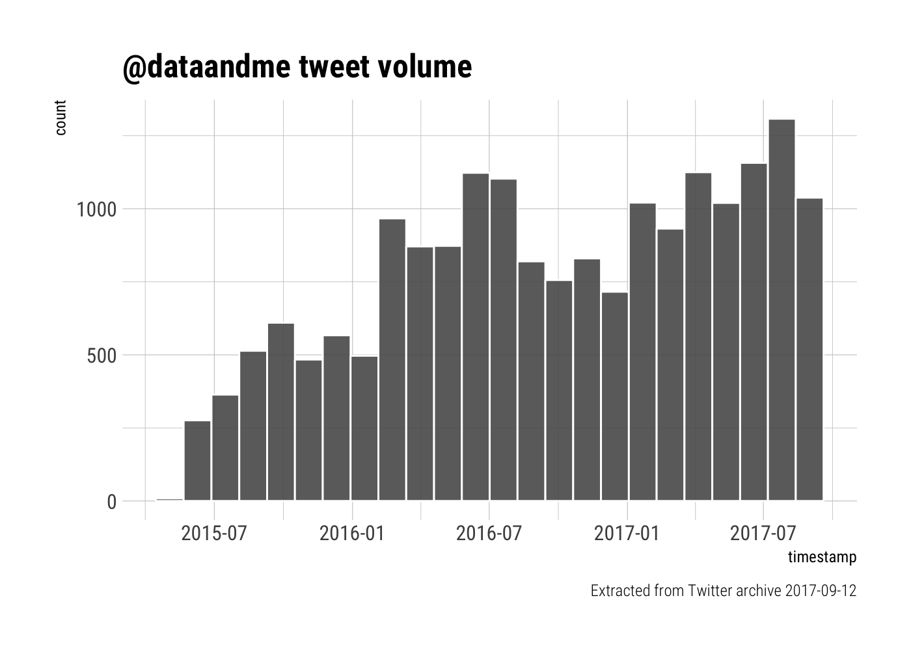

# Two Years of Tweets
Mara Averick  
2017-06-15  


Updated: 2017-09-03

## Motivation

In their very excellent book, [**Text Mining with R: A Tidy Approach**](http://tidytextmining.com/), [Julia Silge](http://juliasilge.com/) and [David Robinson](http://varianceexplained.org/) include a [case study](http://tidytextmining.com/twitter.html) comparing their respective twitter archives.[^1] They do so using the R package they co-authored, [`tidytext`](https://github.com/juliasilge/tidytext), which is a lot of fun to use. So, since I like playing with `tidytext`, and obviously want to be cool like Julia and Dave, I thought I'd poke around in my own tweets of yore.[^2] As I do not have a partner in crime with whom to compare my tweets, I'll also draw on an older (but still awesome in its own right) post from Julia's blog, [_Ten Thousand Tweets_](https://juliasilge.com/blog/ten-thousand-tweets/).

## Getting the data

I'm literally following the [TidyText guide](http://tidytextmining.com/twitter.html), so just mosey over there for a step-by-step break down.


```r
library(tidyverse)
library(lubridate)
library(scales)
library(hrbrthemes)
```


```r
# read in data
tweets <- read_csv("data/tweets.csv",
  col_types = cols(in_reply_to_status_id = col_character(),
                   in_reply_to_user_id = col_character(),
                   retweeted_status_id = col_character(),
                   retweeted_status_user_id = col_character(),
                   tweet_id = col_character()))

# convert datetimes using lubridate
tweets <- tweets %>%
  mutate(timestamp = ymd_hms(timestamp)) %>%
  mutate(retweeted_status_timestamp = ymd_hms(retweeted_status_timestamp)) %>%
  mutate(person = "Mara") %>%  ## add Mara as person
  arrange(desc(timestamp))  ## arrange descending by date
```

We can take a look at our shiny new data frame using `glimpse()`.


```r
glimpse(tweets)
```

```
## Observations: 16,026
## Variables: 11
## $ tweet_id                   <chr> "875337618539544577", "875337454655...
## $ in_reply_to_status_id      <chr> NA, "844184322970173440", NA, "8751...
## $ in_reply_to_user_id        <chr> NA, "15496407", NA, "16047639", NA,...
## $ timestamp                  <dttm> 2017-06-15 13:02:05, 2017-06-15 13...
## $ source                     <chr> "<a href=\"http://bufferapp.com\" r...
## $ text                       <chr> "Make some awesome #maps w/ ease: \...
## $ retweeted_status_id        <chr> NA, NA, NA, NA, "875058163309056000...
## $ retweeted_status_user_id   <chr> NA, NA, NA, NA, "20963651", NA, NA,...
## $ retweeted_status_timestamp <dttm> NA, NA, NA, NA, 2017-06-14 18:31:3...
## $ expanded_urls              <chr> "http://buff.ly/2rzl9CW,https://twi...
## $ person                     <chr> "Mara", "Mara", "Mara", "Mara", "Ma...
```

The data go (temporally-speaking) from when I first tweeted, to when I downloaded the archive (2017-06-15). Let's find out when that first tweet went out. 


```r
first_tweet <- tweets %>%
  summarise(min(timestamp))

first_tweet
```

```
## # A tibble: 1 x 1
##      `min(timestamp)`
##                <dttm>
## 1 2015-05-14 13:32:33
```

## Tweets over time

So, we've basically got two years and one month worth of tweets. Let's take a look at the distribution of tweets over time. Since we've got 25 months, we'll use 25 bins, so that they each cover approximately a month. I'll be using `theme_ipsum_rc()`, which is one of the themes in Bob Rudis' (a.k.a. [\@hrbrmstr](https://twitter.com/hrbrmstr))'s aptly named [`hrbrthemes`](https://hrbrmstr.github.io/hrbrthemes/) package. 


```r
ggplot(tweets, aes(x = timestamp)) +
  geom_histogram(position = "identity", bins = 24, show.legend = FALSE, color = "white", alpha = 0.9) +
  labs(title = "@dataandme tweet volume",
       caption = "Extracted from Twitter archive 2017-06-15") +  ## use labs w/ hrbrthemes
  theme_ipsum_rc()
```



From the look of things, I've been tweeting up a storm of late.

The `timestamp` variable contains quite a bit of information, so it's worth tidying things up. We can use the datetime to get the date, and put it into `yyyy-mm-dd` format, which can then be separated into: year, month, and day.[^3]


```r
tweets <- tweets %>%
  mutate(date = as_date(timestamp)) %>%
  separate(date, into = c("year", "month", "day"), sep = "-", remove = FALSE)
```

Let's take a look at how my monthly tweet volume has changed over the years.


```r
ggplot(tweets, aes(x = month, fill = year)) +
  geom_histogram(position = "identity", stat = "count", show.legend = FALSE, alpha = 0.9) +
  facet_wrap(~year, ncol = 1) +
  labs(caption = "n.b. data only through June 15") +
  theme_minimal() +
  theme(strip.text.x = element_text(face = "bold"),
        panel.grid.minor = element_blank())
```


What about the days of the week?


```r
ggplot(data = tweets, aes(x = wday(timestamp, label = TRUE))) +
        geom_histogram(breaks = seq(0.5, 7.5, by =1), stat = "count", show.legend = FALSE, color = "white", alpha = 0.9) +
        theme(legend.position = "none") +
        labs(title = "@dataandme tweets by day of the week",
             x = "days of the week",
             caption = "Extracted from Twitter archive 2017-06-15") +
        theme_ipsum_rc()
```


It _looks_ like, in the aggregate, I'm pretty darn consistent. But, let's run a chi-squared test to see if the variation in tweet distribution is _really_ in the realm of random sampling error.[^4]


```r
chisq.test(table(wday(tweets$timestamp, label = TRUE)))
```

```
## 
## 	Chi-squared test for given probabilities
## 
## data:  table(wday(tweets$timestamp, label = TRUE))
## X-squared = 50.16, df = 6, p-value = 4.366e-09
```

Well well well... Looks _can_ be deceiving.

## What's in those tweets?

Well, let's take [`tidytext`](https://github.com/juliasilge/tidytext) out for a spin and see.[^word_freq] We'll also need to load the `stringr` package because, although it is part of the [`tidyverse`](http://tidyverse.org/) collection of packages, it's not among the **core** packages that are automatically loaded when you run `library(tidyverse)`.


```r
library(tidytext)
library(stringr)

replace_reg <- "https://t.co/[A-Za-z\\d]+|http://[A-Za-z\\d]+|&amp;|&lt;|&gt;|RT|https"
unnest_reg <- "([^A-Za-z_\\d#@']|'(?![A-Za-z_\\d#@]))"
tidy_tweets <- tweets %>% 
  filter(!str_detect(text, "^RT")) %>%
  mutate(text = str_replace_all(text, replace_reg, "")) %>%
  unnest_tokens(word, text, token = "regex", pattern = unnest_reg) %>%
  filter(!word %in% stop_words$word,
         str_detect(word, "[a-z]"))
```

By using `unnest_tokens()`, I broke all of the non-re-tweet tweets down into individual words.


```r
frequency <- tidy_tweets %>% 
  group_by(person) %>% 
  count(word, sort = TRUE) %>% 
  left_join(tidy_tweets %>% 
              group_by(person) %>% 
              summarise(total = n())) %>%
  mutate(freq = n/total)

library(pander)
pandoc.table(top_n(frequency, 5), style = "rmarkdown")
```

```
## 
## 
## | person |     word     |  n   | total  |   freq   |
## |:------:|:------------:|:----:|:------:|:--------:|
## |  Mara  |   #rstats    | 1697 | 109702 | 0.01547  |
## |  Mara  |   #dataviz   | 1427 | 109702 | 0.01301  |
## |  Mara  |     data     | 1015 | 109702 | 0.009252 |
## |  Mara  |    icymi     | 482  | 109702 | 0.004394 |
## |  Mara  | @tanyacash21 | 459  | 109702 | 0.004184 |
```

So, it looks like the things I tweet about most are R (`#rstats`), data visualization (`#dataviz`), data (and or stuff pertaining thereto), and heads-up-ing/poking/bugging [tcash](https://twitter.com/tanyacash21). All noble topics in their own right.

Because we're looking at change over time and using ~months as our units of measure, let's filter out tweets from June, since the month's only half-way through.


```r
tidy_tweets <- tidy_tweets %>%
  filter(timestamp >= as.Date("2016-05-1"),
         timestamp < as.Date("2017-06-1"))
```


```r
words_by_time <- tidy_tweets %>%
  filter(!str_detect(word, "^@")) %>%
  mutate(time_floor = floor_date(timestamp, unit = "1 month")) %>%
  count(time_floor, person, word) %>%
  ungroup() %>%
  group_by(person, time_floor) %>%
  mutate(time_total = sum(n)) %>%
  group_by(word) %>%
  mutate(word_total = sum(n)) %>%
  ungroup() %>%
  rename(count = n) %>%
  filter(word_total > 30)  ## just words w/ 30+ mentions

words_by_time
```

```
## # A tibble: 2,847 x 6
##    time_floor person             word count time_total word_total
##        <dttm>  <chr>            <chr> <int>      <int>      <int>
##  1 2016-05-01   Mara            #d3js     3       3176         48
##  2 2016-05-01   Mara         #datasci     3       3176         51
##  3 2016-05-01   Mara         #dataviz    67       3176        876
##  4 2016-05-01   Mara             #ddj     2       3176         62
##  5 2016-05-01   Mara         #ggplot2     4       3176         41
##  6 2016-05-01   Mara #machinelearning     5       3176         71
##  7 2016-05-01   Mara            #maps     8       3176        100
##  8 2016-05-01   Mara           #maths     4       3176         31
##  9 2016-05-01   Mara             #nba     7       3176        134
## 10 2016-05-01   Mara       #nerdhumor     6       3176         52
## # ... with 2,837 more rows
```


```r
nested_data <- words_by_time %>%
  nest(-word, -person)

nested_data
```

```
## # A tibble: 234 x 3
##    person             word              data
##     <chr>            <chr>            <list>
##  1   Mara            #d3js <tibble [12 x 4]>
##  2   Mara         #datasci <tibble [13 x 4]>
##  3   Mara         #dataviz <tibble [13 x 4]>
##  4   Mara             #ddj <tibble [13 x 4]>
##  5   Mara         #ggplot2 <tibble [13 x 4]>
##  6   Mara #machinelearning <tibble [13 x 4]>
##  7   Mara            #maps <tibble [13 x 4]>
##  8   Mara           #maths <tibble [12 x 4]>
##  9   Mara             #nba <tibble [13 x 4]>
## 10   Mara       #nerdhumor <tibble [13 x 4]>
## # ... with 224 more rows
```

For modeling `purrr`-poses (get it?), next we're gonna do a little bit of nesting.[^nesting]


```r
library(purrr)

nested_models <- nested_data %>%
  mutate(models = map(data, ~ glm(cbind(count, time_total) ~ time_floor, ., 
                                  family = "binomial")))

nested_models
```

```
## # A tibble: 234 x 4
##    person             word              data    models
##     <chr>            <chr>            <list>    <list>
##  1   Mara            #d3js <tibble [12 x 4]> <S3: glm>
##  2   Mara         #datasci <tibble [13 x 4]> <S3: glm>
##  3   Mara         #dataviz <tibble [13 x 4]> <S3: glm>
##  4   Mara             #ddj <tibble [13 x 4]> <S3: glm>
##  5   Mara         #ggplot2 <tibble [13 x 4]> <S3: glm>
##  6   Mara #machinelearning <tibble [13 x 4]> <S3: glm>
##  7   Mara            #maps <tibble [13 x 4]> <S3: glm>
##  8   Mara           #maths <tibble [12 x 4]> <S3: glm>
##  9   Mara             #nba <tibble [13 x 4]> <S3: glm>
## 10   Mara       #nerdhumor <tibble [13 x 4]> <S3: glm>
## # ... with 224 more rows
```

Using David Robinson's package, `broom`, we can get the results of our nested models back into a nice and tidy format for further examination, and plotting.


```r
library(broom)

slopes <- nested_models %>%
  unnest(map(models, tidy)) %>%
  filter(term == "time_floor") %>%
  mutate(adjusted.p.value = p.adjust(p.value))
```

Now let's take a look at the terms with the top slopes (in absolute value).


```r
top_slopes <- slopes %>% 
  filter(adjusted.p.value < 0.1)

top_slopes
```

```
## # A tibble: 9 x 8
##   person        word       term      estimate    std.error statistic
##    <chr>       <chr>      <chr>         <dbl>        <dbl>     <dbl>
## 1   Mara     #rstats time_floor  1.988530e-08 2.850450e-09  6.976196
## 2   Mara #statistics time_floor -6.568951e-08 1.715566e-08 -3.829029
## 3   Mara      archer time_floor  3.798934e-08 1.043280e-08  3.641338
## 4   Mara          bc time_floor  4.699781e-08 1.066157e-08  4.408151
## 5   Mara        code time_floor  3.508227e-08 6.865772e-09  5.109734
## 6   Mara        days time_floor  4.851829e-08 1.340797e-08  3.618614
## 7   Mara      hahaha time_floor  6.632954e-08 1.511174e-08  4.389271
## 8   Mara        step time_floor  4.274309e-08 7.893053e-09  5.415280
## 9   Mara      #polog time_floor -5.841950e-08 1.486084e-08 -3.931102
## # ... with 2 more variables: p.value <dbl>, adjusted.p.value <dbl>
```


```r
words_by_time %>%
  inner_join(top_slopes, by = c("word", "person")) %>%
  ggplot(aes(time_floor, count/time_total, color = word)) +
  geom_line(size = 1) +
  labs(title = "Trending words in @dataandme tweets", 
       x = NULL, y = "Word frequency") +
  theme_ipsum_rc()
```


----
## All this made possible by...


```r
library(thankr)
thankees <- shoulders()
library(DT)
datatable(thankees)
```

<!--html_preserve--><div id="htmlwidget-892125714a157d1ab641" style="width:100%;height:auto;" class="datatables html-widget"></div>
<script type="application/json" data-for="htmlwidget-892125714a157d1ab641">{"x":{"filter":"none","data":[["1","2","3","4","5","6","7","8","9","10","11","12","13","14","15","16","17","18","19","20","21","22","23","24","25","26","27","28","29","30","31","32","33","34","35","36","37"],["Hadley Wickham &lt;hadley@rstudio.com&gt;","R Core Team &lt;R-core@r-project.org&gt;","Kirill Müller &lt;krlmlr+r@mailbox.org&gt;","Winston Chang &lt;winston@stdout.org&gt;","Lionel Henry &lt;lionel@rstudio.com&gt;","Julia Silge &lt;julia.silge@gmail.com&gt;","Yihui Xie &lt;xie@yihui.name&gt;","Dirk Eddelbuettel &lt;edd@debian.org&gt;","JJ Allaire &lt;jj@rstudio.com&gt;","Bob Rudis &lt;bob@rud.is&gt;","Gergely Daróczi &lt;daroczig@rapporter.net&gt;","Hadley Wickham &lt;h.wickham@gmail.com&gt;","Deepayan Sarkar &lt;deepayan.sarkar@r-project.org&gt;","Achim Zeileis &lt;Achim.Zeileis@R-project.org&gt;","Milan Bouchet-Valat &lt;nalimilan@club.fr&gt;","Joe Cheng &lt;joe@rstudio.com&gt;","Jeremy Stephens &lt;jeremy.stephens@vanderbilt.edu&gt;","R Core Team &lt;R-core@R-project.org&gt;","Jim Hester &lt;james.f.hester@gmail.com&gt;","Jennifer Bryan &lt;jenny@rstudio.com&gt;","Charlotte Wickham &lt;cwickham@gmail.com&gt;","Jennifer Bryan &lt;jenny@stat.ubc.ca&gt;","William Revelle &lt;revelle@northwestern.edu&gt;","Justin Talbot &lt;justintalbot@gmail.com&gt;","Lincoln Mullen &lt;lincoln@lincolnmullen.com&gt;","David Robinson &lt;admiral.david@gmail.com&gt;","Jim Hester &lt;james.hester@rstudio.com&gt;","Michel Lang &lt;michellang@gmail.com&gt;","Jeroen Ooms &lt;jeroen@berkeley.edu&gt;","Adelchi Azzalini &lt;adelchi.azzalini@unipd.it&gt;","Marek Gagolewski &lt;gagolews@rexamine.com&gt;","Stefan Milton Bache &lt;stefan@stefanbache.dk&gt;","Gábor Csárdi &lt;csardi.gabor@gmail.com&gt;","Martin Maechler &lt;mmaechler+Matrix@gmail.com&gt;","James Hester &lt;james.hester@rstudio.com&gt;","Vitalie Spinu &lt;spinuvit@gmail.com&gt;","R-core &lt;R-core@R-project.org&gt;"],[15,11,5,4,3,2,2,2,2,1,1,1,1,1,1,1,1,1,1,1,1,1,1,1,1,1,1,1,1,1,1,1,1,1,1,1,1],["assertthat, dplyr, forcats, ggplot2, gtable, haven, httr, lazyeval, modelr, plyr, rvest, scales, stringr, tidyr, tidyverse","base, compiler, datasets, graphics, grDevices, grid, methods, parallel, stats, tools, utils","bindr, bindrcpp, hms, rprojroot, tibble","extrafont, extrafontdb, R6, Rttf2pt1","purrr, rlang, tidyselect","janeaustenr, tidytext","evaluate, knitr","digest, Rcpp","rmarkdown, rstudioapi","hrbrthemes","pander","reshape2","lattice","colorspace","SnowballC","htmltools","yaml","foreign","glue","readxl","munsell","cellranger","psych","labeling","tokenizers","broom","readr","backports","jsonlite","mnormt","stringi","magrittr","pkgconfig","Matrix","xml2","lubridate","nlme"]],"container":"<table class=\"display\">\n  <thead>\n    <tr>\n      <th> <\/th>\n      <th>maintainer<\/th>\n      <th>no_packages<\/th>\n      <th>packages<\/th>\n    <\/tr>\n  <\/thead>\n<\/table>","options":{"crosstalkOptions":{"key":null,"group":null},"columnDefs":[{"className":"dt-right","targets":2},{"orderable":false,"targets":0}],"order":[],"autoWidth":false,"orderClasses":false},"selection":{"mode":"multiple","selected":null,"target":"row"}},"evals":[],"jsHooks":[]}</script><!--/html_preserve-->


```r
library(praise)
praise::praise()
```

```
## [1] "You are mathematical!"
```


[^1]: Julia ([\@juliasilge](https://twitter.com/juliasilge)), and Dave ([\@drob](https://twitter.com/drob)) are excellent tweeters, well worth following-- though, given that you're reading this, I'm guessing the probability that you already do so is pretty high.

[^2]: See Twitter's [_Downloading your Twitter archive_](https://support.twitter.com/articles/20170160#) if you want to check out your own 140-character collection.

[^3]: I'm also setting the `separate()` argument `remove = FALSE`. This way we keep the date, and have individual year, month, and day values.

[^4]: Also, as previously mentioned, I want to be super cool like Julia, and she did this for her [Ten Thousand Tweets](https://juliasilge.com/blog/ten-thousand-tweets/) analysis. So, there.

[^word_freq]: Again, I'm still following [Tidy Text Mining with R](http://tidytextmining.com), specifically [*7.2 Word frequencies*](http://tidytextmining.com/twitter.html#word-frequencies-1) here.

[^nesting]: This is very well explained in the [twitter-case-study section](http://tidytextmining.com/twitter.html) of [Tidy Text Mining with R](http://tidytextmining.com).
